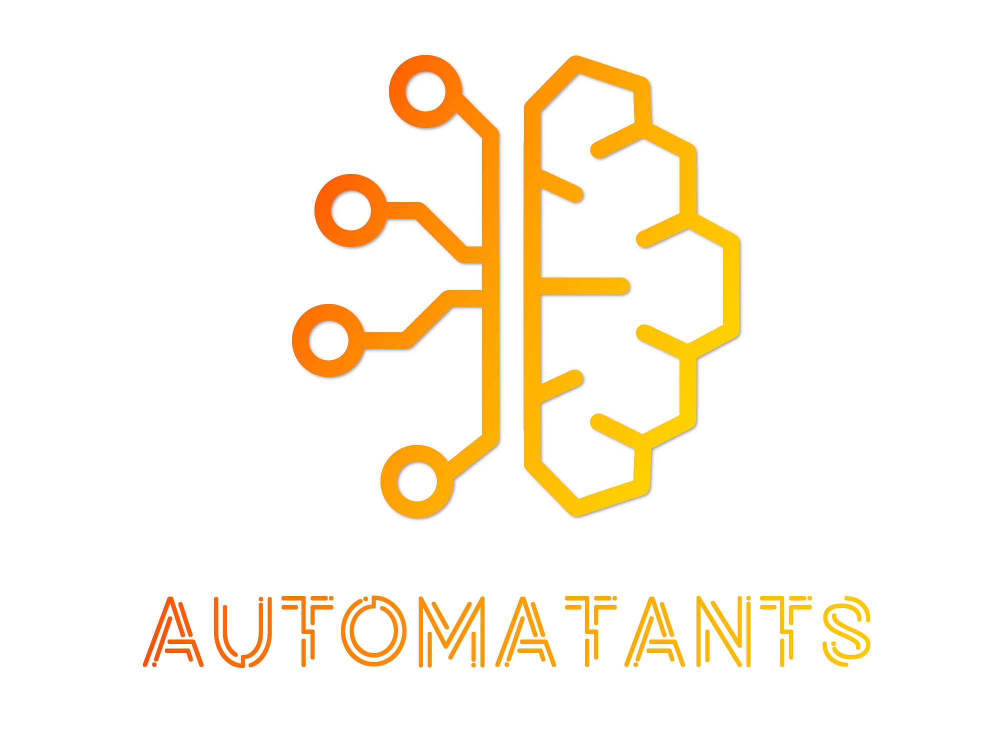
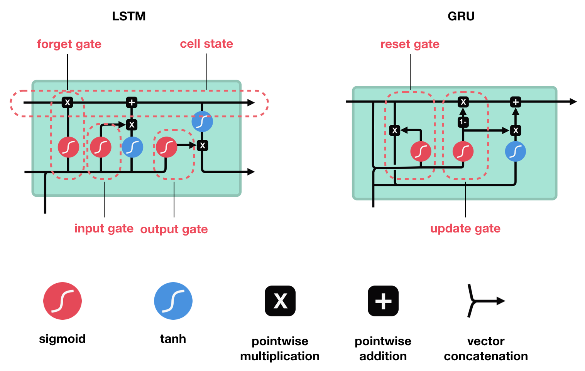

# automatants

Tous les scipts de mes formations pour l'association d'IA de CentraleSupélec [__Les Automatants__](https://automatants.cs-campus.fr/).



## Formation JAX - CIFAR-10 avec CNN


L'objectif de cette formation est de présenter une pipeline d'entraînement de modèle de deep learning (en l'occurence des CNN séquentiels) pour le jeu de données CIFAR-10 en utilisant le framework [**JAX**](https://github.com/google/jax). C'est un framework développé par Deep-Mind (Google) qui permet de construire des modèles de machine learning de manière performante (compilation XLA) et plus flexible que son homologue Tensorflow, utilisant un framework presque entièrement basé sur les `nd.array` de numpy (mais stocké sur le GPU, ou TPU si disponible). Il fournit également des utilitaires inédits pour le calcul de gradient (per example, backward **et** forward) ainsi qu'un meilleur système de seed (pour la reproductibilité) et un outil pour batcher des opérations compliquées automatiquement et efficacement.

Lien de la doc: <https://jax.readthedocs.io/en/latest/index.html>.

L'objectif est de coder soi-même sa propre pipeline d'entraînement pendant la formation en réécrivant une version de `cnn_cifar10.py` en utilisant les fonctions utilitaires de `utils/`. Ensuite, il faudra améliorer le modèle notamment en limitant l'overfitting !

### Dataset

[CIFAR-10](https://www.cs.toronto.edu/~kriz/cifar.html) est un jeu de données de 60000 images de taille 32x32 RGB labelisées selon 10 classes (airplane, automobile, bird, cat, deer, dog, frog, horse, ship, truck). L'objectif est tout simplement de prédire le plus souvent possible la classe des images.

### Installation

Cf le README de `formation jax`.

### Quick start

Cf le README de `formation jax`.

## Formation Pytorch - MLP et CNN sur MNIST

L'objectif de la formation est de faire un MLP et un CNN sur [Pytorch](https://pytorch.org/) pour de la classification sur le jeu de données MNIST.


## Formation Réseaux de Neurones Récurrents (RNN)

Valentin GOLDITE - 08/04/2022



### Introduction

Les réseaux de neurones récurrents sont une famille de réseaux de neurones un peu particulier. Les réseaux de neurones classiques prennent en entrée un batch de données qui sont traitées en parralèlle et séparément. En revanche les réseaux de neurones récurrents prennent en entrée un batch de **séquences** de données et chaque séquence est traitée en prenant les données successivement et les sorties précédentes interviennent dans le calcul de la sortie actuelle. Ainsi, ils sont en quelque sorte une généralisation des multi layers perceptrons car ils permettent d'inclure un aspect "séquentiel" (="temporel" le plus souvent) dans le calcul des prédictions.

### Installation

Clonez le repertoire dans un dossier local:

```script
git clone git@github.com:valentingol/automatants.git
cd formation\ pytorch
```

Créez un nouvel environment virtuel avec `virtualenv`:

```script
python3 -m venv <path to env>
source <path to env>/bin/activate
```

Ou avec `virtualenvwrapper`:

```script
mkvirtualenv <name of env>
```

Puis installez les packages requis avec `pip`:

```script
cd formation\ rnn
pip install -r requirements.txt
```

Vous pouvez à présent faire touner le code pour entraîner un LSTM avec tensorflow:

```script
python train_rnn.py
```

## Formation Transformers

Les transformers sont une source majeure d'architecture state-of-the-art dans presque tous les domaines du deep learning (NLP, vision, audio et dans une moindre mesure reinforcement learning et tabular data). Le présent package est le cadre de la formation Transformer pour les Automatants utilisant les transformers de [Hugging Face](https://huggingface.co/docs/transformers/index)


### Installation

Dans un environnement virtuel, installez le package:

```script
cd formation\ transformer
pip install -r requirements.txt
```

### Quickstart

Le fichier `canevas.ipynb` contient le notebook à compléter de la formation.

Le notebook complet est `main_torch.ipynb` (en Pytorch) et `main_jax.ipynb` (en JAX).

Quelques figures d'attention pour la traduction englais - français:


