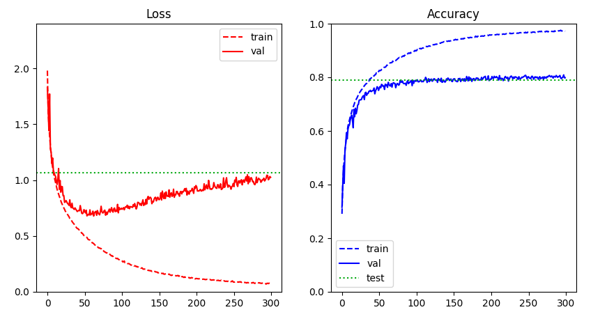

# Formation JAX - CIFAR-10 avec CNN


L'objectif de cette formation est de présenter une pipeline d'entraînement de modèle de deep learning (en l'occurence des CNN séquentiels) pour le jeu de données CIFAR-10 en utilisant le framework [**JAX**](https://github.com/google/jax). C'est un framework développé par Deep-Mind (Google) qui permet de construire des modèles de machine learning de manière performante (compilation XLA) et plus flexible que son homologue Tensorflow, utilisant un framework presque entièrement basé sur les `nd.array` de numpy (mais stocké sur le GPU, ou TPU si disponible). Il fournit également des utilitaires inédits pour le calcul de gradient (per example, backward **et** forward) ainsi qu'un meilleur système de seed (pour la reproductibilité) et un outil pour batcher des opérations compliquées automatiquement et efficacement.

Lien de la doc: <https://jax.readthedocs.io/en/latest/index.html>.

L'objectif est de coder soi-même sa propre pipeline d'entraînement pendant la formation en réécrivant une version de `cnn_cifar10.py` en utilisant les fonctions utilitaires de `utils/`. Ensuite, il faudra améliorer le modèle notamment en limitant l'overfitting !

## Dataset

[CIFAR-10](https://www.cs.toronto.edu/~kriz/cifar.html) est un jeu de données de 60000 images de taille 32x32 RGB labelisées selon 10 classes (airplane, automobile, bird, cat, deer, dog, frog, horse, ship, truck). L'objectif est tout simplement de prédire le plus souvent possible la classe des images.


## Installation

**Attention**: L'installation nécessite une distribution Linux, MacOS ou WSL2 (Windows). L'installation de JAX est plus compliqué que pour les autres frameworks, il est recommandé d'installer tous les paquets un par un:

On commence comme toujours par se placer dans un environment virtuel.

Par exemple avec Virtualenvwrapper:

```script
mkvirtualenv -p python3.X formation_jax
```

Avec Virtualenv:

```script
virtualenv -p python3.X ~/.venv/formation_jax
source ~/.venv/formation_jax/bin/activate
```

Avec Conda (déconseillé sur Linux ou WSL2):

```script
conda create -n formation_jax python=3.X
conda activate formation_jax
```

### Installer JAX

Le script suivant est à utiliser en priorité si vous disposez d'une carte graphique Nvidia et que vous avez installez CUDA et CuDNN (note: jaxlib sera automatiquement installé):

```script
pip install --upgrade "jax[cuda]" -f https://storage.googleapis.com/jax-releases/jax_releases.html
```

Si une erreur intervient ou que vous n'avez pas de GPU, vous pouvez installer JAX d'après le les indications du repository JAX: [JAX - Installation](https://github.com/google/jax#installation). Privilégiez une installation compatible avec CUDA pour utiliser les bibliothèques de calcul sur GPU (autrement le CPU sera automatiquement utilisé) quand vous avez une carte graphique Nvidia (utiliser JAX sur TPU est également possible).

### Installer les modules additionnels de JAX

La communauté de JAX a développé un grand nombre de modules additionnels qui peuvent être utilisés avec JAX et qui facilite son utilisation notamment pour le machine learning et le développement. Dans cette formation nous auront besoin d'**Optax** (un module qui ajoute des fonctions telles que des optimzers, des fonctions de perte et des métriques) et de **Haiku** (un module qui fournit des fonctions et classes de haut-niveau un peu comme Keras pour Tensorflow et des utilitaires qui facilitent l'intégration des modèles de machine learning en JAX):

```script
pip install optax dm-haiku
```

Doc d'Haiku: <https://dm-haiku.readthedocs.io/en/latest/>

Doc d'Optax: <https://optax.readthedocs.io/en/latest/>

### Installer Tensorflow (CPU-only !)

Tensorflow 2 est bien souvent utilisé dans les pipelines de machine learning utilisant JAX en framework de calcul. La raison ? Tensorflow cotient des classes de gestion de données (`tf.data.Dataset`) très utile pour faire du traitement rapide et maniable de données (mise en batch, en prefetch, en cache, répétition, etc...).

**Attention** Tensorflow va par défaut accaprer une partie de la mémoire VRAM (= la RAM du GPU) dès la première utilisation de celui-ci. Pour nous, Tensorflow ne va servir que pour disstribuer les batchs de données qui seront ensuite déplacé de la mémoire CPU vers la VRAM (GPU) par JAX. Il est donc inutile (et contre-productif) d'installer le support GPU pour Tensorflow.

On installe donc préférentiellement Tensorflow **avec sa version CPU-only** en suivant l'instruction du site officiel [Installer TensorFlow avec pip](https://www.tensorflow.org/install/pip?hl=fr#package-location) en fonction de votre OS et de la version de Python (utilisez Linux pour WSL).

Par exemple en Python 3.9 avec Linux:

```script
pip install tensorflow -f https://storage.googleapis.com/tensorflow/linux/cpu/tensorflow_cpu-2.6.0-cp39-cp39-manylinux2010_x86_64.whl
```

### Installer les autres librairies

On a besoin de **Matplotlib** pour visualiser les résultats de l'entraînement.

```script
pip install matplotlib
```

## Quick start

L'objectif est de refaire en formation le modèle de `cnn_cifar10.py` avec la pipeline d'entraînement complète mais vous pouvez aussi bien entendu exécuter l'entraînement du script directement:

```python3
python3 cnn_cifar10.py
```

Une visualisation des résultats sera affichée à la fin de l'entraînement et le modèle sera sauvegardé dans le dossier `./models/My_vgg8` (par défaut).

## Les modèles pre-trained

Deux modèles pre-trained sont disponibles. Le premier est un modèle qui a beaucoup overfitté. Le second est essentiellement le même modèle auquel on a rahouté du dropout croissant. A vous d'améliorer les modèles. Quand vous êtes surs de vous vous pouvez faire un test sur l'ensemble de test (mais pas avant !).

Exemple de courbe (modèle très overfitté):



Note: il existe d'autres méthodes simples et communément utilisées autres que l'amélioration de l'architecture du modèle...

:wink:
