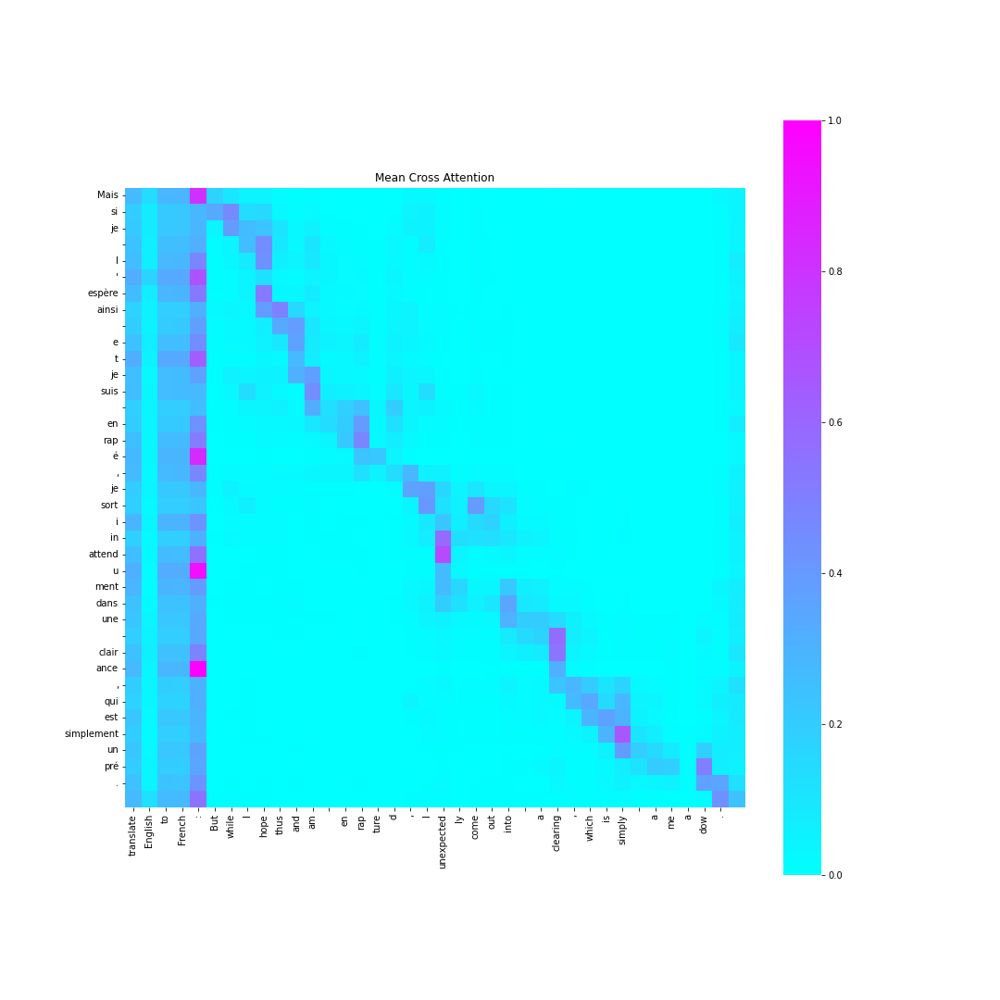
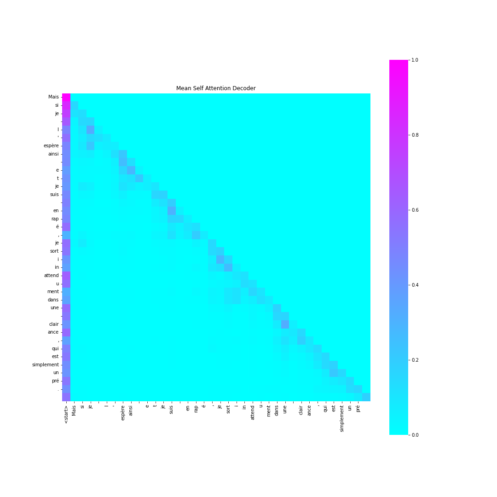

# Formation Transformer

Les transformers sont une source majeure d'architecture state-of-the-art dans presque tous les domaines du deep learning (NLP, vision, audio et dans une moindre mesure reinforcement learning et tabular data). Le présent package est le cadre de la formation Transformer pour les Automatants utilisant les transformers de [Hugging Face](https://huggingface.co/docs/transformers/index)


## Installation

Dans un environnement virtuel, installez le package:

```script
pip install -r requirements.txt
```

## Formation

Le fichier `canevas.ipynb` contient le notebook à compléter de la formation.

Le notebook complet est `main_torch.ipynb` (en Pytorch) et `main_jax.ipynb` (en JAX).

Quelques figures d'attention pour la traduction englais - français:




